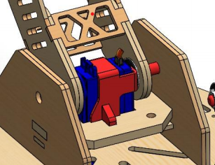

# Robotic Arm Project - Invisible Arm Team 


## Project Overview

This project is a 5-DOF robotic arm powered by high-torque servo motors for precise, automated object manipulation. Its modular rotary joints use PWM control to deliver repeatable, accurate motions ideal for pick-and-place tasks. Designed for light industrial automation, assembly, and educational use, the arm features a servo-driven gripper offering reliable grasping with fine grip and positioning control. Built for scalability, it supports easy integration with sensors and advanced control systems.

<div align="center">
   <br>
  <i>Complete CAD assembly showing the robotic arm structure </i>
</div>

## Table of Contents
- [Project Overview](#project-overview)
- [Features](#features)
- [Hardware Components](#hardware-components)
- [Technical Specifications](#technical-specifications)
- [Installation](#installation)
- [Code Structure](#code-structure)
- [Analysis & Simulation](#analysis--simulation)
- [Acknowledgments](#acknowledgments)
- [License](#license)


## Features

- **5-DOF Configuration**: Base rotation, shoulder, elbow, wrist, and dual gripper control
- **360° Base Rotation**: Enhanced flexibility for workspace coverage
- **Precision Gripper**: Dual-servo gripper system for secure object manipulation
- **Automated Sequences**: Pre-programmed pick-and-place operations
- **Modular Design**: Easy assembly and maintenance
- **Educational Focus**: Ideal for robotics learning and prototyping

## Hardware Components

### Servo Configuration

| Servo | Pin | Function | Range | Description |
|-------|-----|----------|-------|-------------|
| Base | 9 | Horizontal Rotation | 0°-90° | Controls arm base rotation |
| Link | 10 | Shoulder Joint | 90°-120° | Main arm segment control |
| Stamp | 11 | Wrist/Forearm | 0°-80° | End effector positioning |
| Gripper | 5 | Primary Grip | 70°-115° | Main gripper mechanism |
| Gripper_2 | 6 | Secondary Grip | 10°-40° | Fine grip adjustment |

### Mechanical Structure

- **Materials**: Laser-cut wood components and 3D-printed servo mounts
- **Bearings**: Integrated for smooth rotational motion between linkages
- **Link Dimensions**: 
  - L1 = 22 cm (Base to first joint)
  - L2 = 20.8 cm (First joint to end effector)
- **Payload Capacity**: 0.3 kg maximum

<div align="center">
   <br>
  <i>3D-printed servo holder assembly with integrated bearings</i>
</div>

## Technical Specifications

| Specification | Value |
|---------------|-------|
| **Maximum Reach** | 42.8 cm (L1 + L2) |
| **Payload Capacity** | 0.3 kg |
| **Joint 1 Torque** | 22.1 kg·cm |
| **Joint 2 Torque** | 8.15 kg·cm |
| **Operating Voltage** | 6V (recommended) |
| **Cycle Time** | 30-45 seconds per sequence |
| **DOF** | 5 (3 main joints + 2 gripper) |
| **Repeatability** | ±1-2 degrees (servo-dependent) |

## Installation

### Prerequisites

- Arduino IDE
- Arduino Uno or compatible microcontroller
- 5x Servo motors (SG90 or similar)
- External 6V power supply
- Jumper wires and breadboard
- Servo library (included in Arduino IDE)

### Hardware Setup

1. **Clone the repository**
   ```bash
   git clone https://github.com/yourusername/robotic-arm-project.git
   cd robotic-arm-project
   ```

2. **Assemble the mechanical structure**
   - Follow CAD assembly instructions
   - Mount servos using 3D-printed holders
   - Install bearings for smooth joint operation
   - Ensure proper alignment of all linkages

3. **Wiring connections**
   ```
   Base Servo     → Arduino Pin 9
   Link Servo     → Arduino Pin 10
   Stamp Servo    → Arduino Pin 11
   Gripper Servo  → Arduino Pin 5
   Gripper_2      → Arduino Pin 6
   Power Supply   → External 6V (servo power)
   ```

<div align="center">
   <br>
  <i>Complete wiring schematic for the robotic arm</i>
</div>

4. **Upload the code**
   - Open `source_code.ino` in Arduino IDE
   - Select your board type and port
   - Compile and upload to Arduino
   - Open Serial Monitor (9600 baud) for debugging

### Testing

1. Power on the system with external power supply
2. The arm will automatically start the pick-and-place sequence
3. Monitor servo positions through Serial Monitor
4. Verify smooth movement and proper grip operation

## Code Structure

The control system operates in 4 sequential phases:

### Phase 1: Approach Target
- Base rotation from 0° to 90°
- Arm extension from 90° to 120°
- Wrist positioning from 0° to 80°

### Phase 2: Grab Object
- Open primary gripper (90° → 115°)
- Adjust secondary gripper (10° → 40°)
- Close primary gripper to secure object (115° → 70°)
- Fine-tune secondary gripper (40° → 10°)

### Phase 3: Lift & Transport
- Raise wrist/stamp (80° → 45°)
- Retract main arm (120° → 90°)
- Return base to starting position (90° → 0°)

### Phase 4: Release Object
- Open secondary gripper for object release (10° → 40°)
- Cycle repeats automatically

### Key Code Features

```cpp
// Smooth servo movement with configurable delays
for (pos_base; pos_base <= 90; pos_base += 1) {
    base.write(pos_base);
    delay(15); // 15ms for smooth movement
}

// Serial debugging for position monitoring
Serial.println(pos_stamp);
```

### Customization Options

- **Speed Control**: Modify `delay()` values (15-50ms recommended)
- **Range Adjustment**: Change servo angle limits in for loops
- **Sequence Modification**: Reorder or add movement phases
- **Sensor Integration**: Add position feedback or force sensing

## Analysis & Simulation

### RoboAnalyzer Simulation

3D simulation verification using RoboAnalyzer:
- R-R-R configuration modeling (3 revolute joints)
- Forward/inverse kinematics validation
- Movement visualization and path planning
- Joint limit and workspace boundary analysis

<div align="center">
   <br>
  <i>3D simulation of the robotic arm in RoboAnalyzer</i>
</div>

### Finite Element Analysis (FEA)

Structural analysis of mechanical components:
- **Stress Analysis**: Verification of component strength under load
- **Displacement Analysis**: Deflection calculations for accuracy
- **Safety Factor**: Ensuring reliable operation within design limits

<div align="center">
   <br>
  <i>FEA force distribution</i>
</div>
<br>

<div align="center">
   <br>
  <i>FEA Stress Analysis</i>
</div>
<br>

<div align="center">
   <br>
  <i>FEA Displacement Analysis</i>
</div>

### Code Style Guidelines

- Follow Arduino coding conventions
- Use meaningful variable names and comments
- Include function documentation
- Test all changes before submitting

## Troubleshooting

### Common Issues

**Servo not moving properly:**
- Check power supply (6V recommended)
- Verify wiring connections
- Ensure servo limits are within 0-180°

**Erratic movement:**
- Check for loose connections
- Verify servo mounting is secure
- Reduce movement speed (increase delay values)

**Serial communication issues:**
- Confirm baud rate is set to 9600
- Check USB cable connection
- Verify correct COM port selection

## Future Enhancements

- **Sensor Integration**: Force sensors, position feedback, vision systems
- **Advanced Control**: PID control, trajectory optimization
- **User Interface**: Real-time control GUI, mobile app
- **AI Integration**: Machine learning for adaptive grasping
- **Multi-Arm Coordination**: Synchronized operation of multiple arms

## Acknowledgments

**Built with passion for robotics education and innovation**
*This project demonstrates the integration of mechanical design, control systems, and kinematic analysis in modern robotics applications.*

- Alexadria University robotics program for project support
- Arduino community for extensive servo control libraries
- MATLAB/Simulink for powerful analysis and simulation tools
- RoboAnalyzer developers for kinematic simulation capabilities
- Open source robotics community for inspiration and resources
- All team members for their dedicated contributions to this project

## License

This project is licensed under the MIT License - see the [LICENSE](LICENSE.txt) file for details.
